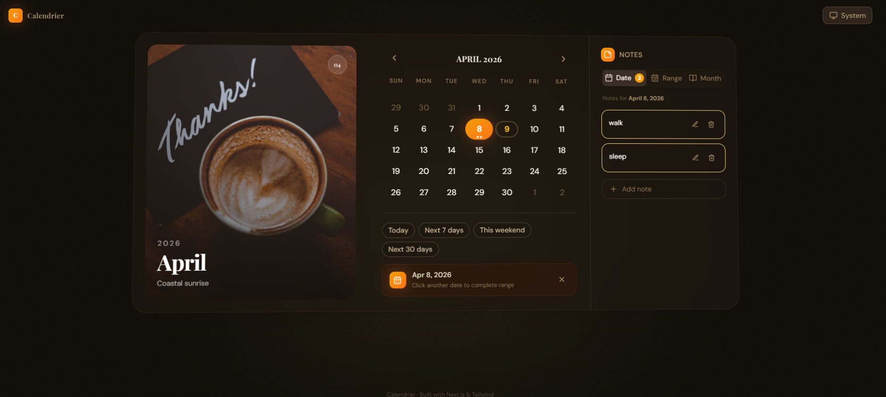
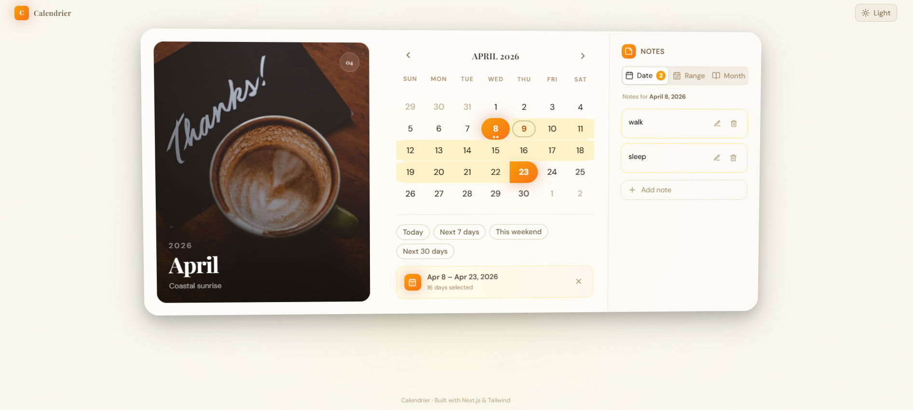

# ✨ Calendrier — Premium Wall Calendar

> A beautifully crafted, production-grade wall calendar with animations, range selection, and an advanced notes system — built for modern web experiences.

---

## 🌐 Live Demo (Vercel)
https://calander-swart.vercel.app
🚀

---

## 📸 Preview

<!-- Add your screenshots here -->

<p align="center">
  
</p>
<p align="center">
  
</p>
---

## ⚡ Features

### 📅 Smart Date Selection

- Click to select start date
- Hover preview for range
- Auto swap (if reversed)
- Third click resets selection

### 🗒️ Advanced Notes System

- Notes for:
  - Single dates
  - Date ranges
  - Entire months

- 🎨 5 color-coded labels
- Inline editing

### 🎨 Premium UI/UX

- Glassmorphism design
- Gradient accents
- Smooth shadows & depth
- Fully responsive

### 🌙 Dark Mode

- System-aware + manual toggle
- No flicker (FOUC-free)
- Persistent via localStorage

### ✨ Micro Interactions

- Smooth animations (Framer Motion)
- 3D tilt effect
- Animated transitions

### ♿ Accessibility

- Keyboard navigation
- ARIA labels
- Focus indicators

---

## 🧠 Architecture Highlights

| Feature          | Implementation                   |
| ---------------- | -------------------------------- |
| State Management | Centralized (`useCalendar`)      |
| Performance      | `useMemo` + `React.memo`         |
| Notes Storage    | Optimized localStorage structure |
| Animations       | Framer Motion                    |
| Date Logic       | date-fns                         |

---

## 🧱 Tech Stack

```bash
Next.js 14
React 18
TypeScript
Tailwind CSS
Framer Motion
date-fns
```

---

## 🚀 Getting Started

```bash
# Clone repo
git clone https://github.com/your-username/calendrier.git

# Go to project
cd calendrier

# Install dependencies
npm install

# Run dev server
npm run dev
```

👉 Open http://localhost:3000

---

## 📂 Project Structure

```
wall-calendar/
│
├── app/
├── components/
│   ├── calendar/
│   ├── notes/
│   └── ui/
├── hooks/
├── lib/
├── types/
└── tailwind.config.ts
```

---

## 🧩 Core Components

- **Calendar.tsx** → Main container
- **CalendarGrid.tsx** → Grid logic
- **DayCell.tsx** → Day rendering
- **MonthHeader.tsx** → Navigation
- **NotesPanel.tsx** → Notes UI

---

## 🧪 Key Features Breakdown

### 🔥 Range Selection Logic

- Handles reverse selection
- Supports single-day selection
- Live preview while hovering

### 📌 Notes Engine

- O(1) lookup using structured keys
- Month-based storage (`YYYY-MM`)
- Supports range + date merging

---

## 📈 Future Improvements

- 🔐 Authentication (Google / Email)
- ☁️ Cloud sync (MongoDB / Firebase)
- 📱 Mobile-first UI
- 🧲 Drag & Drop events
- 📊 Analytics dashboard

---

## 🚀 Deployment

Deploy easily using:

- ▲ Vercel (Recommended)
- Netlify

```bash
npm run build
npm start
```

---

## 🤝 Contributing

Contributions are welcome!

```bash
# Fork the repo
# Create a new branch
git checkout -b feature-name

# Commit changes
git commit -m "Added feature"

# Push
git push origin feature-name
```

---

## 📜 License

MIT License

---

## 💡 Author

**Ujjwal Kumar**

- 💻 Passionate Developer
- 🚀 Building real-world products

---

## ⭐ Show Your Support

If you like this project:

👉 Give it a ⭐ on GitHub
👉 Share it with friends
